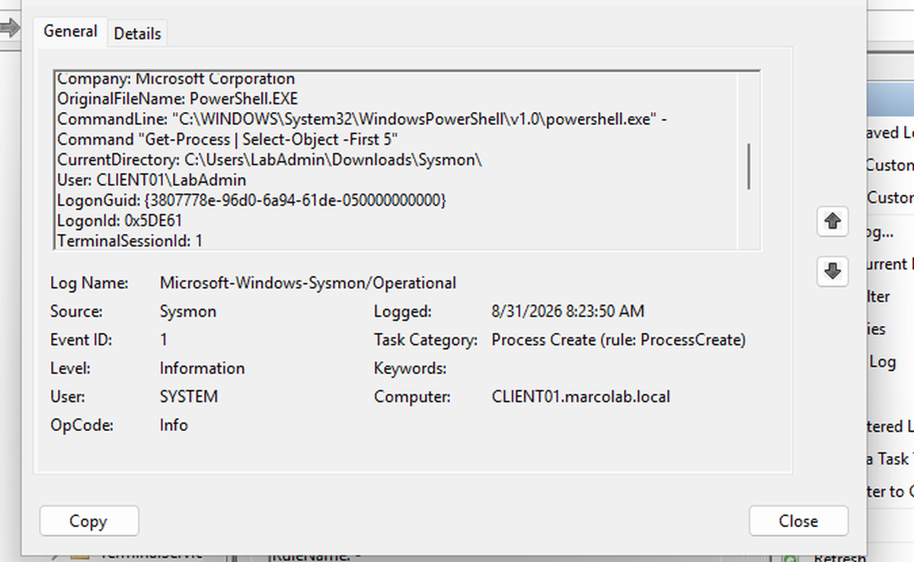
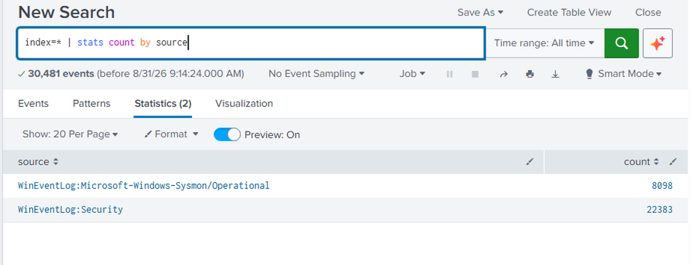
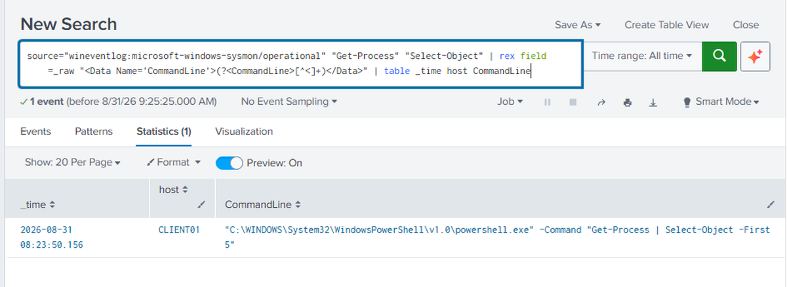
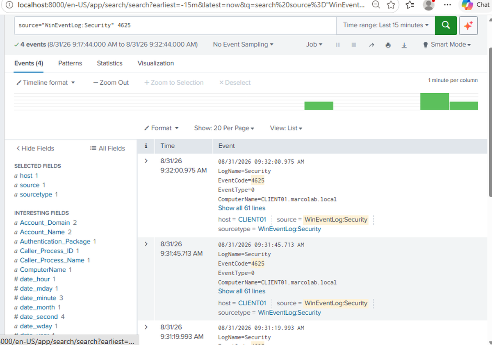

# Windows Threat Detection & Incident Response Lab

## Overview

This project is a Windows security monitoring lab built to practice log collection, threat detection, and security event investigation.

I configured Splunk Enterprise and Sysmon on a Windows 11 virtual machine to collect and analyze Windows Security and endpoint process telemetry. I then generated controlled authentication failures and PowerShell activity and used Splunk searches to investigate the resulting events.

## Lab Environment

- Windows 11 Pro
- Oracle VirtualBox
- Splunk Enterprise
- Microsoft Sysmon
- Windows Event Logs
- PowerShell
- MITRE ATT&CK

**Endpoint:** `CLIENT01.marcolab.local`

## Sysmon Configuration

I installed Microsoft Sysmon on `CLIENT01` to provide additional Windows endpoint telemetry.

Sysmon records detailed system activity such as process creation and stores the events in:

`Microsoft-Windows-Sysmon/Operational`

I verified that the Sysmon service was running and generated harmless PowerShell activity for testing.

The PowerShell command used during testing was:

`Get-Process | Select-Object -First 5`

Sysmon recorded the PowerShell process as **Event ID 1 - Process Create**.

## Splunk Log Collection

I installed Splunk Enterprise locally on `CLIENT01` and configured it to ingest two Windows event sources:

- `WinEventLog:Security`
- `WinEventLog:Microsoft-Windows-Sysmon/Operational`

I verified ingestion by counting events from each source in Splunk.

This provided both Windows authentication events and detailed Sysmon endpoint telemetry for investigation.

## PowerShell Activity Detection

I used Splunk to search Sysmon process creation events for PowerShell activity.

The search isolated the test command generated earlier:

`Get-Process | Select-Object -First 5`

The result identified the timestamp, endpoint, and PowerShell command line recorded by Sysmon.

### MITRE ATT&CK Mapping

The PowerShell activity was mapped to:

**T1059.001 - Command and Scripting Interpreter: PowerShell**

This demonstrated how endpoint process telemetry can be searched to identify command-line activity during an investigation.

## Failed Authentication Detection

I generated controlled failed authentication attempts for a test domain account using incorrect credentials.

Windows recorded the failed logons as:

**Event ID 4625 - An account failed to log on**

I searched the Windows Security logs in Splunk and identified the failed authentication events generated during the test.

The events included information such as:

- Timestamp
- Source computer
- Account information
- Logon type
- Failure reason

### MITRE ATT&CK Mapping

Repeated password-guessing activity was mapped to:

**T1110 - Brute Force**

The activity in this lab was intentionally generated in a controlled environment for security monitoring practice.

## Investigation Workflow

The lab followed a basic detection and investigation workflow:

1. Generate controlled endpoint or authentication activity.
2. Collect Windows Security and Sysmon logs.
3. Ingest the event data into Splunk.
4. Search for relevant authentication and process activity.
5. Review timestamps, endpoints, accounts, processes, and failure information.
6. Map relevant behavior to MITRE ATT&CK techniques.

## Skills Practiced

- Splunk Enterprise
- Sysmon
- Windows Event Logs
- Security Monitoring
- Log Analysis
- PowerShell
- Authentication Analysis
- Endpoint Telemetry
- Incident Investigation
- Event Correlation
- MITRE ATT&CK
- Windows Security Event ID 4625
- Sysmon Event ID 1
- VirtualBox

## What I Learned

This project helped me understand how endpoint and authentication telemetry can be collected and investigated using a security monitoring platform.

I gained hands-on experience configuring Splunk data inputs, collecting Sysmon and Windows Security events, searching endpoint process activity, investigating failed authentication attempts, and connecting observed behavior to MITRE ATT&CK techniques.
